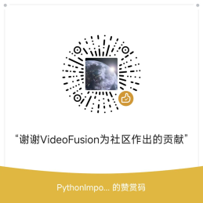

<h1 align="center">
    VideoFusion
</h1>
<p align="center">一站式视频批量处理软件<p>
<p align="center">
    点击即用，自动去黑边，智能拼接，补帧，自动调整分辨率，白平衡，AI 音频降噪
</p>


## 软件介绍

VideoFusion 旨在打造一个上手即用，随用随走的轻量化视频批量优化和处理工具，对于无经验的视频创作者您只需要几次点击就能实现视频拼接，AI音频降噪，超分平滑，白平衡，亮度自动调整，补帧等功能，使用 VideoFusion 帮助您预处理您的视频，您无需关心参数和更多细节，VideoFusion 会自动帮您处理好剩下复杂的逻辑


<center>
<div>
<p>软件详情请前往文档进行查看</p>
<a href="https://271374667.github.io/VideoFusion/">点我前往文档</a>
</div>
</center>


## 上手指南

### 推荐运行方法

直接通过 Release 下载最新的版本直接点击其中的 exe 文件即可运行

### 编译运行

> 推荐运行环境 Python 3.10
> 备注: 可以选择更高版本,但是不能低于 Python 3.10

通过在项目根目录下输入下面的命令安装第三方库

```cmd
pip install -r requirements.txt
```

然后运行项目根目录下的 `video_fusion.py` 文件

## 额外说明

- 该软件支持 Window10 64位 以及 Window11 64位，其余 Window 版本未经过测试，不保证稳定运行
- 该软件永久免费，如果您在其他地方付费下载到了该软件请马上退款止损
- 如果您使用出现了问题或者对软件的建议请您在该页面提出 issue

## 捐赠

开源的梦想是一个崇高的事业，它使得社区成长, 代码得以培育。 根据自由开源的理念，VideoFusion致力于Good Labs的原则 。

如果我的工作对您的事业产生了帮助，请考虑将一些资金返还给开发团队，您的捐赠会让 VideoFusion更好的发展和更新，让我知道还有人在使用本产品，开源的财务支持字面上意味着开发项目的人有另外的理由坚持下去

许多有前途的开源项目变成了“放弃软件”，因为最初的开发人员已经失去了动力。 维护阶段实际上是许多开源项目死亡的地方。 金钱是一种很好的社区反馈，它说“坚持下去并继续维护这个项目！我们需要你!!!”

### 你从中获得了什么[¶](https://somethingcool.top/SimpleWMS/donation.html#_2)

- 如果您支持开源，您将成为社区的一员。 这是一个庞大的社区，但往往紧密结合。 您的支持表明您相信社区，这使您成为家庭的一部分。 如果足够的财务支持汇集在一起，也可能意味着核心开发人员和维护人员能够全职工作而不需要在其他地方工作。 这反过来又促进了一个环境，在这个环境中，他们能够比在“业余爱好”的基础上更快地处理修复和请求。
- 因此，也许您是一家使用开源软件为自己提供竞争优势、提高利润或简单解决其他软件无法解决的问题的企业。 也许你是一个使用开源解决方案的个人，你无法承受昂贵的企业软件。就像这个例子。
- 或者您认识到数万行代码是您不必编写的行，仅仅只是感谢这背后的努力。
- 无论您使用什么样的开源软件，都要想到那些花了很长时间开发它并让它为您运行的人。
- 即使是一笔小额捐款也可能对他们产生巨大的影响，尤其是因为这意味着有人会非常感激他们并让他们知道。

### 如何捐赠？[¶](https://somethingcool.top/SimpleWMS/donation.html#_3)

您可以通过邮箱联系我进行捐赠，也可以通过下方的二维码进行捐赠


