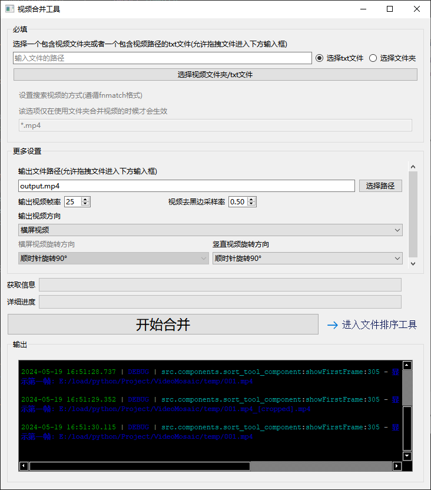
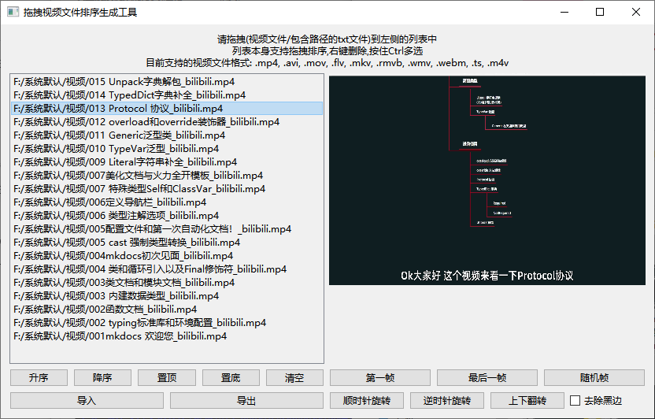

<h1 align="center">
    VideoMosaic
</h1>
<p align="center">一个简陋但又不简单的视频拼接软件<p>
<p align="center">
    无依赖,点击即用,自动去黑边,自动帧同步,自动调整分辨率,批量变更视频为横屏/竖屏
</p>





## 软件功能

1. **自研视频去黑边**，去边缘Logo，去动态图标，去字幕，快速提取视频主体
2. **自动旋转视频为横屏/竖屏**，让所有的视频观感一致
3. **自动补帧/抽帧到指定帧率**，使用算法平滑补帧/抽帧，相比传统补帧/抽帧方式，该算法使用全局分析，最大程度保证拼接之后视频的连贯性和稳定性
4. 便捷的文件排序工具，自动根据文件名中的数字、日期、重命名后缀例如(3)、进行排序，同时还能快速查看视频内容，同时封面自动跳过黑色画面，保证每一个视频的封面都清晰可见，支持旋转，支持拖拽排序，导入导出等操作
5. 支持市面上大部分视频格式，同时支持使用dll的方式扩展OpenCv的编码器
6. 实时进度条以及彩色输出框，精准显示当前程序状态获取程序日志

## 上手指南

### 推荐运行方法

直接通过 Release 下载最新的版本直接点击其中的 exe 文件即可运行

### 编译运行

> 推荐运行环境 Python 3.10
> 备注: 可以选择更高版本,但是不能低于 Python 3.10

通过在项目根目录下输入下面的命令安装第三方库

```cmd
pip install -r requirements.txt
```

然后运行项目根目录下的 `video_mosaic.py` 文件

## 使用指南

推荐使用 txt 来进行视频拼接，txt可以通过软件中内置的【文件排序工具】生成，然后通过调整更多设置之后点击开始合并等待合并完成即可
