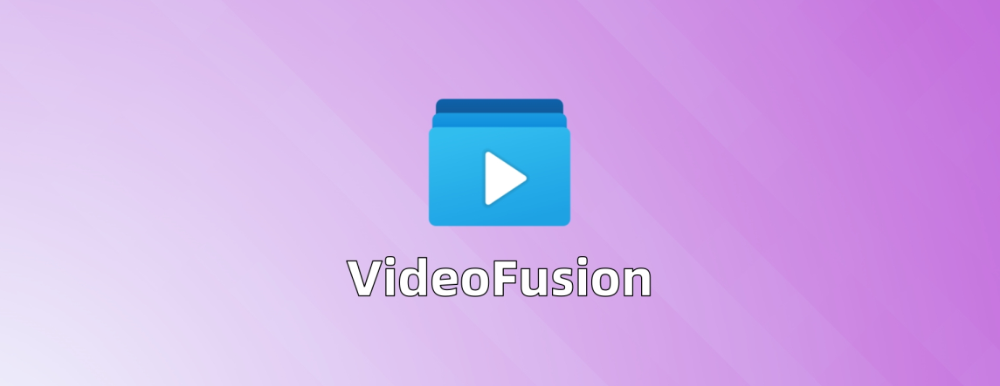

<h1 align="center">
    VideoFusion
</h1>
<p align="center">一站式视频批量处理软件<p>
<p align="center">
    点击即用，自动去黑边，智能拼接，补帧，自动调整分辨率，白平衡，AI 音频降噪
</p>
<p align="center">
    
    
    
    
    
</p>




## 10 秒爱上VideoFusion

下面这个 GIF 将会带您快速查看两个有不规则黑边的视频是如何完美去除黑边然后旋转成正确的朝向最后合并的


## ✨软件介绍

VideoFusion 旨在打造一个上手即用，随用随走的轻量化视频批量优化和处理工具，对于无经验的视频创作者您只需要几次点击就能实现视频拼接，AI音频降噪，超分平滑，白平衡，亮度自动调整，补帧等功能，使用 VideoFusion 帮助您预处理您的视频，您无需关心参数和更多细节，VideoFusion 会自动帮您处理好剩下复杂的逻辑

VideoFusion 最初的目标是制作一个能够快速去除大量视频黑边的软件，其中还需要为对视频进行合成，但是视频的尺寸不一致，分辨率也不一致，视频内横屏还是竖屏的状态也不一致，于是我开发了这个软件，能够批量将视频去除黑边后旋转到统一尺寸最后合并，相比其他的合并软件，VideoFusion 合并视频会计算最佳的分辨率，进行缩放/旋转/剪裁等一系列操作后才会进行合并，确保大量视频哪怕分辨率不一致，合成完毕之后的黑边区域面积最小（其他软件分辨率不一致直接合并会出现大量黑边，严重影响观感）

同时 VideoFusion 对去黑边进行了特化，可以去除多种多样的黑边，视频外有 logo，多余的文字都可以进行去除

在不断的发展中 VideoFusion 功能越来越强大，经过 VideoFusion 处理过的视频，大小可能仅为原来的一半！但是画面却没有肉眼可见的损失，同时还增加了大量新的功能，例如白平衡，亮度自动调整，响度自动调整，补帧等等功能，功能非常多而且未来还会继续更新，欢迎大家前往文档查看

## 🚀功能介绍


<div align="center">
    <p align="center">软件详情请前往文档进行查看</p>
    <a href="https://271374667.github.io/VideoFusion/">点我前往文档</a>
</div>


## 如何运行该项目

### 推荐运行方法(用户)

直接通过 Release 下载最新的版本直接点击其中的 exe 文件即可运行

### 编译运行(程序员)

> 推荐运行环境 Python 3.10
> 备注: 可以选择更高版本,但是不能低于 Python 3.10

通过在项目根目录下输入下面的命令安装第三方库

```cmd
pip install -r requirements.txt
```

然后运行项目根目录下的 `video_fusion.py` 文件

## 额外说明

- 该软件支持 Window10 64位 以及 Window11 64位，其余 Window 版本未经过测试，不保证稳定运行
- 该软件永久免费，如果您在其他地方付费下载到了该软件请马上退款止损
- 如果您使用出现了问题或者对软件的建议请您在该页面提出 issue
- 如果您有更多的问题请前往文档查看