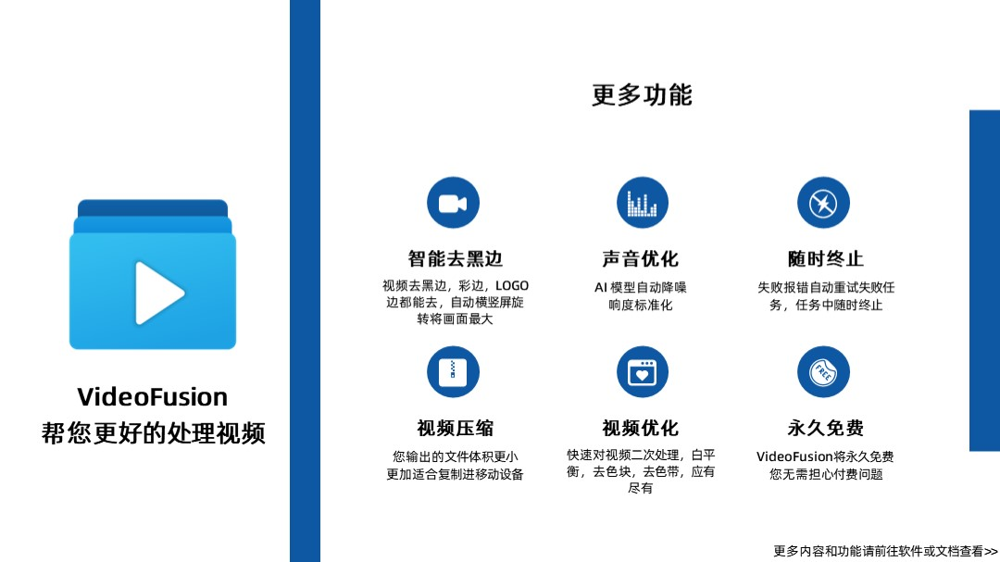

<h1 align="center">
    VideoMosaic
</h1>
<p align="center">一个实用的小视频拼接软件<p>
<p align="center">
    无依赖,点击即用,自动去黑边,自动帧同步,自动调整分辨率,批量变更视频为横屏/竖屏
</p>





## 软件介绍

如果你有大量小视频(~~老司机懂得都懂~~)，他们之间的分辨率不一致，有的是横屏，有的是竖屏，有的有黑边，有的有 Logo ，有的有字幕，有的有动态图标，甚至有的时候视频的顺序都不对，你想要将他们拼接在一起，但是又不想花费大量时间使用 Pr 或者其他专业剪辑软件去调整每一个视频，修改他们的帧率，分辨率那么这个软件就是为你而生的

你可以方便的修改他们的顺序，统一视频是横屏还是竖屏，把视频拉到同一个帧率，您不需要掌握FFmpeg或者其他高端的命令，仅仅是使用 VideoMosaic，他会帮你完成这一切

## 软件功能

1. **算法去黑边**，去边缘Logo，去动态图标，去字幕，快速提取视频主体
2. **自动旋转视频为横屏/竖屏**，让所有的视频观感一致
3. **自动计算最佳分辨率**，软件会遍历所有视频计算出最适合所有视频的分辨率最后将他们缩放到该分辨率，确保所有的视频都能有最好的观感
4. **视频质量提升**，软件在设置页面内置包括诸如"视频降噪"，"视频去抖动"，"音量自动平衡"等功能，可以帮您一键提升您的视频质量(如果需要更好的效果请使用专业补帧和超分工具)
5. **便捷的文件排序工具**，自动根据文件名中的数字、日期、重命名后缀例如(3)、进行排序，同时还能快速查看视频内容，同时封面自动跳过黑色画面，保证每一个视频的封面都清晰可见，支持旋转，支持拖拽排序，导入导出等操作
6. **支持市面上大部分视频格式**，同时支持使用dll的方式扩展OpenCv的编码器
7. **实时进度条以及彩色输出框**，精准显示当前程序状态获取程序日志

## 界面展示

### 主页面


### 日志页面


### 设置页面


## 上手指南

### 推荐运行方法

直接通过 Release 下载最新的版本直接点击其中的 exe 文件即可运行

### 编译运行

> 推荐运行环境 Python 3.10
> 备注: 可以选择更高版本,但是不能低于 Python 3.10

通过在项目根目录下输入下面的命令安装第三方库

```cmd
pip install -r requirements.txt
```

然后运行项目根目录下的 `video_mosaic.py` 文件

## 额外说明

- 该软件的目的主要是为了拼接小视频，对于大于20分钟的视频会出现运行缓慢效果不佳的情况，对于大视频的拼接请使用专业的视频编辑软件
- 该软件永久免费，如果您在其他地方付费下载到了该软件请马上退款止损
- 如果您使用出现了问题或者对软件的建议请您在该页面提出 issue
