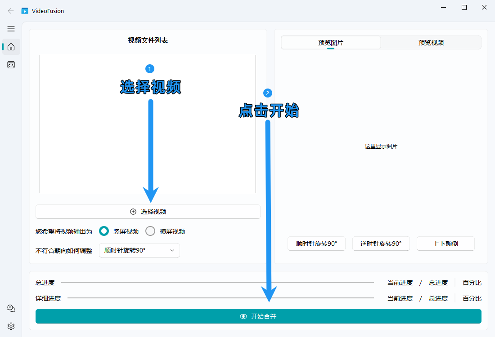

# 快速开始

## 一分钟效果展示

## 如何快速合并一堆视频?

VideoFuison 已经帮您简化了大量的操作，**您只需要 2 次点击就能实现将视频批量合并/处理**

**在处理完成之后，VideoFusion 会自动弹出合并完成之后的文件夹**，您可以在这里找到您的输出文件，当然您也可以自定义输出文件夹的位置，VideoFusion 拥有大量可自定义内容和功能

### 横屏还是竖屏，由您做决定

视频的输出需要您人工进行选择，您可以自由的选择输出的视频是一个横屏的视频还是竖屏的视频，VideoFusion 会智能地帮您旋转不符合规则的视频，让所有的视频都如您所愿

::: info 提示
自动旋转是根据视频的长宽进行判断是否旋转，无法识别画面内容，请自行确保旋转之后的画面内容一致，否则有可能出现上下颠倒或者左右颠倒的情况（不过在代码眼里这依旧是正确的结果）
:::

## 随时终止您的任务

任务太长？配置出现错误？没有关系，随时终止您的任务，释放您的 CPU 和内存，告别 FFmpeg 的后台残留

## 重新开始

VideoFusion 闪退了？任务中断之后后悔了想要重新开始？没有关系，VideoFusion 支持重新开始，轻点 OK 按键让您回到上一次的进度，您甚至可以在修改设置之后再重新开始，VideoFusion 会帮你处理好一切

## 观察输出

如果您的程序卡主了或者很长时间都没有反应，您可以前往输出页面查看报错，将报错提交为 issue 整理好您的报错信息，附上报错原因和环境，作者将很快与您取得联系

## 更多

恭喜您，您已经能够成功使用 VideoFusion 了，不过 VideoFusion 依旧有非常多的特性，您可以在设置页面找到他们，同时您也可以在这个文档里面找到相关的说明和帮助